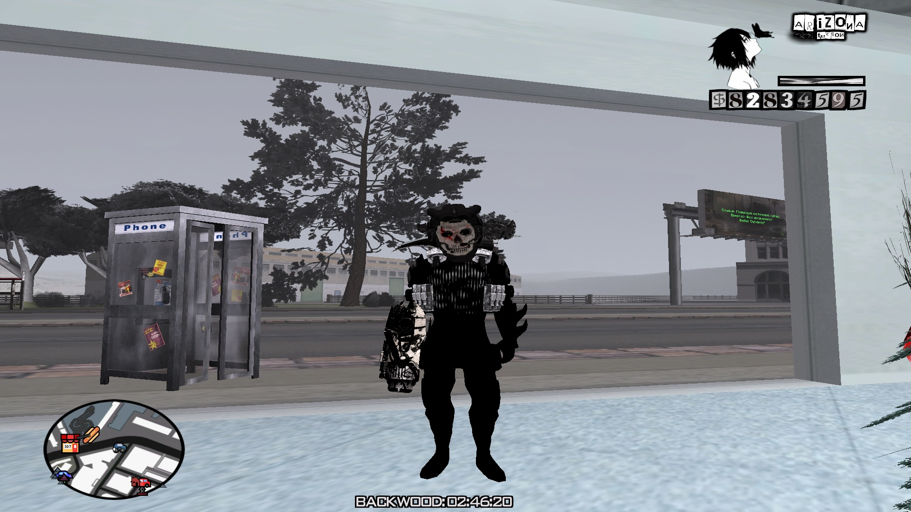

# Добро пожаловать на GitHub-репозиторий игровой сборки Arizona RP Backwood's Dark Edition для лаунчера Arizona Games!

Благодарим Вас за проявленный интерес к контенту Nissan Team!

Описание продукта:  
Arizona RP Backwood's Dark Edition - это немного переосмысленная надстройка для стандартной сборки Arizona RP от игрока Hate_Streak (AKA Uruma_Backwood).  
Выполнена в тёмных тонах (установлен Colormod), изменены элементы HUD'а, растительность, оружие, аксессуары. Cодержит CLEO- и LUA-библиотеки c несколькими полезными модификациями, вот некоторые из них:  
* GameTweaker [/gmenu] - многофункциональный скрипт, расширяющий настройки GTA San Andreas. Оптимизирует и делает игру более приятной;
* Bone HP [/bh]- показывает полоски здоровья, брони на вашем персонаже;
* Patrones.lua [/ptset] - отображает количество патронов над прицелом (полезно в перестрелках);
* ArmourTime [AUTO] - показывает время до автоматической замены надетого бронежилета;
* Logo ARZ [/logo] - изменяет логотип сервера;
* Double Binder [/binder]- простой и интуитивно понятный биндер с быстрой сменой настроек...

Наши контакты:  
Discord-сервер - https://discord.gg/XECKdfTgFP  
Telegram-канал - https://t.me/Nissan_Talks  
Telegram-группа - https://t.me/+aHN945RFVwA2NzYy

Copyright © 2025 Nissan Team, NPO. All rights reserved.
